Sturgill Simpson is frequently described as part of the new era of [outlaw country musicians](http://grantland.com/hollywood-prospectus/the-new-age-outlaw-country-of-lydia-loveless-and-sturgill-simpson/), a group that includes musicians like Tyler Childers, Chris Stapleton, Colter Wall, and Jason Isbell. Sturgill in particular has been at the forefront of this movement in alternative country and Americana music, winning a Grammy in 2015 for his second album *Metamodern Sounds in Country Music* among other accolades at the US and UK Americana Music Awards. Rolling Stone questioned [whether he is country music's savior](https://www.rollingstone.com/music/music-country/is-sturgill-simpson-country-musics-savior-not-if-he-can-help-it-55612/). 

He is also one of my favorite artists. I've been wanting to do a deeper dive into Sturgill's music, and thankfully Charlie Thompson's [spotifyr package](https://github.com/charlie86/spotifyr) makes that easy. 
This project is heavily inspired both by [Charlie's analysis of Radiohead](https://www.rcharlie.com/post/fitter-happier/) and by Simran Vatsa's [analysis of Taylor Swift's music](https://medium.com/@simranvatsa5/taylor-f656e2a09cc3). I adapted much of their code and overall analysis strategy below, [Simran's in particular](https://github.com/simranvatsa/tayloR/blob/master/tayloR_final.R). 

Alright, let's load the packages we'll need first.


```r
library(spotifyr)
library(tidyverse)
library(ggridges)
library(ggthemes)
library(rvest)
library(httr)
library(tidytext)
library(purrr)
library(wordcloud)
library(patchwork)
library(textdata)
library(radarchart)
library(bbplot)
```

# Getting and cleaning data
First we'll need to pull track data from spotify using spotifyr. I then filtered down to unique track names. 


```r
sturgill <- get_artist_audio_features("Sturgill Simpson")
sturgill <- sturgill %>%
    distinct(track_name, .keep_all = TRUE)
```

# Connect with Genius lyrics data
Then we'll go ahead and connect the track information with lyrics from Genius. This code in particular was largely adapted from Simran and Charlie's code (linked above). 


```r
genius_get_artists <- function(artist_name, n_results = 10) {
  baseURL <- 'https://api.genius.com/search?q=' 
  requestURL <- paste0(baseURL, gsub(' ', '%20', artist_name),
                       '&per_page=', n_results,
                       '&access_token=', token)
  
  res <- GET(requestURL) %>% content %>% .$response %>% .$hits
  
  map_df(1:length(res), function(x) {
    tmp <- res[[x]]$result$primary_artist
    list(
      artist_id = tmp$id,
      artist_name = tmp$name
    )
  }) %>% unique
}

genius_artists <- genius_get_artists('Sturgill Simpson')


# Getting track urls
baseURL <- 'https://api.genius.com/artists/' 
requestURL <- paste0(baseURL, genius_artists$artist_id[1], '/songs')

track_lyric_urls <- list()
i <- 1
while (i > 0) {
  tmp <- GET(requestURL, query = list(access_token = token, per_page = 50, page = i)) %>% content %>% .$response
  track_lyric_urls <- c(track_lyric_urls, tmp$songs)
  if (!is.null(tmp$next_page)) {
    i <- tmp$next_page
  } else {
    break
  }
}


# Filtering to get urls only for tracks on which Sturgill is the primary artist
filtered_track_lyric_urls <- c()
filtered_track_lyric_titles <- c()
index <- c()


for (i in 1:length(track_lyric_urls)) {
  if (track_lyric_urls[[i]]$primary_artist$name == "Sturgill Simpson") {
    filtered_track_lyric_urls <- append(filtered_track_lyric_urls, track_lyric_urls[[i]]$url)
    filtered_track_lyric_titles <- append(filtered_track_lyric_titles, track_lyric_urls[[i]]$title)
    
    index <- append(index, i)
  }
}

sturgill_lyrics <- data.frame(filtered_track_lyric_urls, filtered_track_lyric_titles)
#sturgill_lyrics <- sturgill_lyrics[filtered_track_lyric_titles %in% sturgill$track_name, ]
sturgill_lyrics$filtered_track_lyric_urls <- as.character(sturgill_lyrics$filtered_track_lyric_urls)
sturgill_lyrics$filtered_track_lyric_titles <- as.character(sturgill_lyrics$filtered_track_lyric_titles)


# Webscraping lyrics using rvest 
lyric_text <- rep(1, length(sturgill_lyrics$filtered_track_lyric_urls))

for (i in 1:length(sturgill_lyrics$filtered_track_lyric_urls)) {
  lyric_text[i] <- read_html(sturgill_lyrics$filtered_track_lyric_urls[i]) %>% 
    html_nodes(".lyrics p") %>% 
    html_text()
}


# Cleaning and standardizing lyrics
for (i in 1:45) {
  lyric_text[i] <- gsub("([a-z])([A-Z])", "\\1 \\2", lyric_text[i])
  lyric_text[i] <- gsub("\n", " ", lyric_text[i])
  lyric_text[i] <- gsub("\\[.*?\\]", " ", lyric_text[i])
  lyric_text[i] <- tolower(lyric_text[i])
  lyric_text[i] <- gsub("[ [:punct:] ]", " ", lyric_text[i])
  lyric_text[i] <- gsub(" {2,}", " ", lyric_text[i])
}


genius_data <- data.frame(track_name = sturgill_lyrics$filtered_track_lyric_titles, lyrics = lyric_text)
genius_data$track_name <- as.character(genius_data$track_name)
genius_data$lyrics <- as.character(genius_data$lyrics)


## Change track names for join 
genius_data$track_name[genius_data$track_name == "You Can Have The Crown"] <- "You Can Have the Crown"
genius_data$track_name[genius_data$track_name == "Welcome to Earth (Pollywog)"] <- "Welcome To Earth (Pollywog)"
genius_data$track_name[genius_data$track_name == "Water In A Well"] <- "Water in a Well"
genius_data$track_name[genius_data$track_name == "Turtles All The Way Down"] <- "Turtles All the Way Down"
genius_data$track_name[genius_data$track_name == "Remember to Breathe"] <- "Remember To Breathe"
genius_data$track_name[genius_data$track_name == "Mercury in Retrograde"] <- "Mercury In Retrograde"
genius_data$track_name[genius_data$track_name == "Life Ain’t Fair and the World Is Mean"] <- "Life Aint Fair and the World Is Mean"
genius_data$track_name[genius_data$track_name == "Keep It Between the Lines"] <- "Keep It Between The Lines"
genius_data$track_name[genius_data$track_name == "It Ain't All Flowers	"] <- "It Ain't All Flowers	"
genius_data$track_name[genius_data$track_name == "I’d Have To Be Crazy"] <- "I'd Have to Be Crazy"
genius_data$track_name[genius_data$track_name == "Fastest Horse in Town"] <- "Fastest Horse In Town"
genius_data$track_name[genius_data$track_name == "Call to Arms"] <- "Call To Arms"
genius_data$track_name[genius_data$track_name == "Brace for Impact (Live a Little)"] <- "Brace For Impact (Live A Little)"
genius_data$track_name[genius_data$track_name == "Best Clockmaker on Mars"] <- "Best Clockmaker On Mars"
genius_data$track_name[genius_data$track_name == "All Said and Done"] <- "All Said And Done"

## join with sturgill track info from spotify
sturgill <- sturgill %>%
    left_join(genius_data, by = "track_name") %>%
    drop_na(lyrics)
```


# Valence by album
While broadly fitting within the Americana genre (to the extent that Americana has hard boundaries), Sturgill's music has evolved throughout his four albums. One way to look at that might be in valence, which [Spotify defines as](https://developer.spotify.com/documentation/web-api/reference/tracks/get-audio-features/) "A measure from 0.0 to 1.0 describing the musical positiveness conveyed by a track. Tracks with high valence sound more positive (e.g. happy, cheerful, euphoric), while tracks with low valence sound more negative (e.g. sad, depressed, angry)." 

So the first thing we can look at is valence ratings for Sturgill's discography, analyzing whether and how his albums vary in their overall happiness or negativity. 

We might expect his latest album, *SOUND & FURY* to be a little more negative and higher energy than his others. Sturgill descibed it to [KCRW](https://www.kcrw.com/music/shows/todays-top-tune/sturgill-simpson-sing-along) by saying, "We went in without any preconceived notions and came out with a really sleazy, steamy rock n roll record. It’s definitely my most psychedelic, and also my heaviest. I had this idea that it’d be really cool to animate some of these songs, and we ended up with a futuristic, dystopian, post-apocalyptic, samurai film."


```r
sturgill$album_name <- factor(sturgill$album_name, levels = c("SOUND & FURY", "A Sailor's Guide to Earth", "Metamodern Sounds in Country Music", "High Top Mountain"))


sturgill %>%
    ggplot(aes(x = valence, y = album_name, fill = ..x..)) + 
    geom_density_ridges_gradient(scale = 0.9) + 
    scale_fill_gradient(low = "white", high = "red3") + 
    theme_fivethirtyeight() + 
    theme(panel.background = element_rect(fill = "white")) +
    theme(plot.background = element_rect(fill = "white")) +
    theme(legend.position = "none") + 
    ggtitle("Sturgill Simpson's Song Valence (Happiness) by Artist")
```

```
## Picking joint bandwidth of 0.131
```

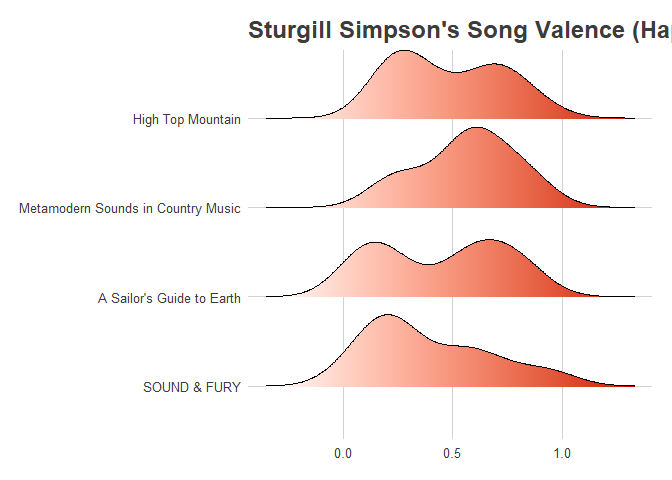<!-- -->

```r
# Avg valence by album
sturgill %>%
    group_by(album_name) %>%
    summarise(avg_val = round(mean(valence), 2))
```

```
## # A tibble: 4 x 2
##   album_name                         avg_val
##   <fct>                                <dbl>
## 1 SOUND & FURY                          0.39
## 2 A Sailor's Guide to Earth             0.44
## 3 Metamodern Sounds in Country Music    0.56
## 4 High Top Mountain                     0.48
```

```r
# Descending rank of valence by track
sturgill %>%
    select(album_name, track_name, valence) %>%
    arrange(desc(valence)) %>%
    head(10)
```

```
##                            album_name                           track_name valence
## 1                        SOUND & FURY                Mercury In Retrograde   0.939
## 2                   High Top Mountain                      Railroad of Sin   0.877
## 3  Metamodern Sounds in Country Music                       A Little Light   0.844
## 4           A Sailor's Guide to Earth            Keep It Between The Lines   0.833
## 5  Metamodern Sounds in Country Music                          Life of Sin   0.814
## 6           A Sailor's Guide to Earth                          Sea Stories   0.764
## 7                   High Top Mountain Life Aint Fair and the World Is Mean   0.734
## 8                   High Top Mountain                            Some Days   0.729
## 9                        SOUND & FURY                          A Good Look   0.712
## 10                  High Top Mountain             Sitting Here Without You   0.666
```

```r
# Descending rank of valence by track
sturgill %>%
    select(album_name, track_name, valence) %>%
    arrange(valence) %>%
    head(10)
```

```
##                            album_name                  track_name valence
## 1                        SOUND & FURY       Fastest Horse In Town  0.0401
## 2           A Sailor's Guide to Earth Welcome To Earth (Pollywog)  0.0773
## 3           A Sailor's Guide to Earth                    Oh Sarah  0.0917
## 4                        SOUND & FURY        Make Art Not Friends  0.1430
## 5           A Sailor's Guide to Earth               Breakers Roar  0.1650
## 6                        SOUND & FURY     Best Clockmaker On Mars  0.1790
## 7                        SOUND & FURY           All Said And Done  0.2050
## 8                   High Top Mountain                   The Storm  0.2060
## 9                   High Top Mountain             Water in a Well  0.2290
## 10 Metamodern Sounds in Country Music                 The Promise  0.2420
```

The first ridgeline plot shows Sturgill's albums by valence, with the peaks showing the highest frequency of valence scores. Then I also pulled the average valence rating by album as well as the top ten highest and lowest valence scores across his four albums. 

This absolutely tracks with expectations -- *SOUND & FURY* is his only right-tailed album and his most negative, while *Metamodern Sounds in Country Music* is left-tailed (generally more positive). Both *High Top Mountain* and *A Sailor's Guide to Earth* are bi-modal, with relatively even balances of positive and negative songs. The average valence ratings by album also support what the ridgeline plots show -- that *SOUND & FURY* is the most negative while *Metamodern Sounds in Country Music* is the most positive. 

In terms of individual tracks, *SOUND & FURY's* "Mercury in Retrograde" is by far his highest-valence song, a funky 70-ish song that sharply contrasts (at least sonically) with anything on *High Top Mountain*. "Fastest Horse in Town", "Welcome to Earth (Pollywog)" and "Oh Sarah" are his three most negative songs, all with a valence rating under 0.1.

# Sonic cohesiveness
As Simran noted in her analysis of Taylor Swift's discography, it might be interesting to explore the idea of "sonic cohesiveness" -- the extent to which the track's on an artist's albums are similar, presenting an overall cohesive sound per album. By summing valence, energy, and danceability, all of which have the same scale in Spotify's data, we can get a sense for that at the album level. 

I created boxplots of sonic cohesiveness and energy, as well as a ridgeline plot of energy too. 


```r
sturgill <- sturgill %>%
    mutate(sonic_cohesiveness = valence + energy + danceability)

ggplot(sturgill, aes(x = album_name, y = sonic_cohesiveness, color = album_name)) + 
    geom_boxplot() + 
    geom_jitter() + 
    theme(axis.text.x = element_text(size = 8), legend.position = "none") +
    scale_color_manual(values = c("firebrick", "navyblue", "purple", "gold1")) +
    xlab("Album") +
    ylab("Sonic cohesiveness")
```

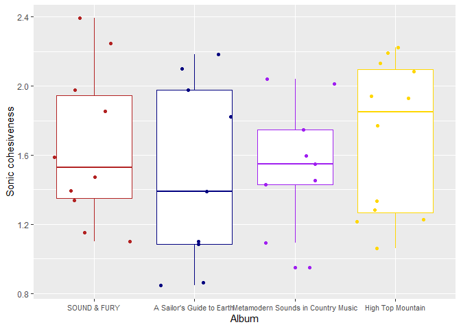<!-- -->

```r
ggplot(sturgill, aes(x = album_name, y = energy, color = album_name)) + 
    geom_boxplot() + 
    geom_jitter() + 
    theme(axis.text.x = element_text(size = 8), legend.position = "none") +
    scale_color_manual(values = c("firebrick", "navyblue", "purple", "gold1")) +
    xlab("Album") +
    ylab("Energy")
```

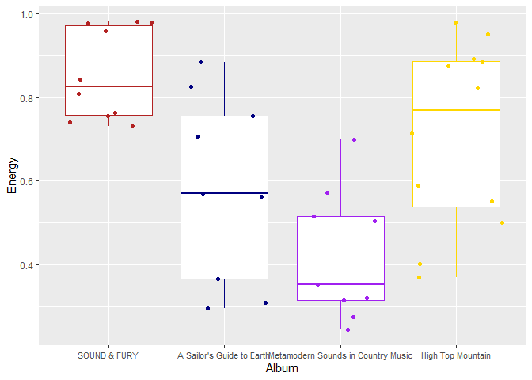<!-- -->

```r
sturgill %>%
    ggplot(aes(x = energy, y = album_name, fill = ..x..)) + 
    geom_density_ridges_gradient(scale = 0.9) + 
    scale_fill_gradient(low = "white", high = "red3") + 
    theme_fivethirtyeight() + 
    theme(panel.background = element_rect(fill = "white")) +
    theme(plot.background = element_rect(fill = "white")) +
    theme(legend.position = "none") + 
    ggtitle("Sturgill Simpson's Song Energy by Album")
```

```
## Picking joint bandwidth of 0.0995
```

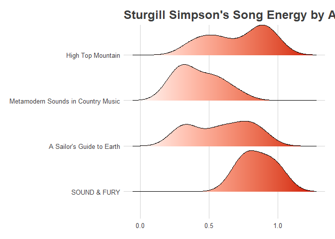<!-- -->

Within the boxplots for sonic cohesiveness, we would expect that the more sonically cohesive album would have a more narrow distribution sonic cohesiveness (in particular a more narrow interquartile range). This first chart shows that *Metamodern Sounds in Country Music* appears to be the most cohesive, while 
*A Sailor's Guide to Earth* is sonically varied -- which is interesting, considering the album is essentially a musical letter to his then-newborn son. 

The energy boxplot and ridgeline plot show the same thing -- the distribution of track energy as grouped by album. Here we can see one element of "sonic cohesiveness" that demonstrates how different *SOUND & FURY* is from his other three albums. *SOUND & FURY* is far more energetic on average, and with a narrow distribution of energy ratings for each track. 

Essentially, *SOUND & FURY* is both more negative and higher energy than his other albums -- something we might expect from an album Sturgill described as "really sleazy, steamy rock n roll record" with an accompanying "futuristic, dystopian, post-apocalyptic" anime movie. 

# Compare with Waylon and Merle
From his early days, Sturgill has been compared with the early generation of outlaw country musicians. Most critics have compared his voice to Waylon Jennings, although Sturgill counts Merle Haggard as a larger influence.

Using spotifyr we can look for similarities in the three artists' sounds. We'll focus on Sturgill's *High Top Mountain*, as it is by far his most traditional country album. 

For the other two artists, who have far more songs in their discographies, it was a greater challenge to find a representative subset of their music for comparison. I settled on the Spotify "This is... " playlists, that Spotify often puts together for notable musicians, which collects the artists' most important (and hopefully representative) songs. I then joined the playlist data with the artists' track data to incorporate the sonic variables like energy, valence, and danceability. 

In subsequent analysis, we might use Sturgill's "This is... " playlist for an even more apples-to-apples comparison, although my guess is that this first look might minimize the differences between the artists.


```r
# Pull track data for Merle and Waylon based from their Spotify "This is..." playlists
merle <- get_artist_audio_features("Merle Haggard")
```

```
## Request failed [429]. Retrying in 1 seconds...
```

```r
merle_thisis <- get_playlist_tracks("37i9dQZF1DWU1xHgjMaSpW")
merle_thisis <- merle_thisis %>%
    inner_join(merle, by = c("track.id" = "track_id"))

waylon <- get_artist_audio_features("Waylon Jennings")
```

```
## Request failed [429]. Retrying in 1 seconds...
```

```r
waylon_thisis <- get_playlist_tracks("37i9dQZF1DZ06evO4si4pO")
waylon_thisis <- waylon_thisis %>%
    inner_join(waylon, by = c("track.id" = "track_id"))

# Combine with Sturgill's High Top Mountain
artist_comp <- merle_thisis %>%
    bind_rows(waylon_thisis) %>%
    select(artist_name, track_name, energy, valence, danceability) 

sturgill_comp <- sturgill %>%
    filter(album_name == "High Top Mountain") %>%
    select(artist_name, track_name, energy, valence, danceability)

artist_comp <- artist_comp %>%
    bind_rows(sturgill_comp)

# Create charts of energy and valence
artist_comp %>%
    ggplot(aes(x = energy, y = artist_name, fill = ..x..)) + 
        geom_density_ridges_gradient(scale = 0.9) + 
        scale_fill_gradient(low = "white", high = "red3") + 
        theme_fivethirtyeight() + 
        theme(panel.background = element_rect(fill = "white")) +
        theme(plot.background = element_rect(fill = "white")) +
        theme(legend.position = "none") + 
        ggtitle("Song Energy by Artist")
```

```
## Picking joint bandwidth of 0.0777
```

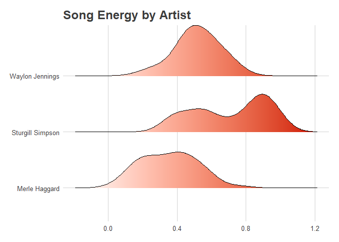<!-- -->

```r
artist_comp %>%
    ggplot(aes(x = valence, y = artist_name, fill = ..x..)) + 
        geom_density_ridges_gradient(scale = 0.9) + 
        scale_fill_gradient(low = "white", high = "red3") + 
        theme_fivethirtyeight() + 
        theme(panel.background = element_rect(fill = "white")) +
        theme(plot.background = element_rect(fill = "white")) +
        theme(legend.position = "none") + 
        ggtitle("Song Valence (Happiness) by Artist")
```

```
## Picking joint bandwidth of 0.105
```

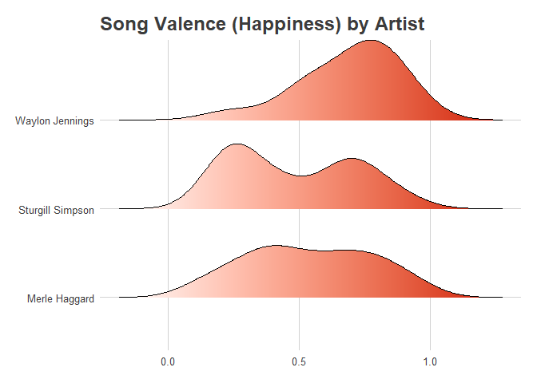<!-- -->

There are some fairly clear differences between the three artists despite us only looking at Sturgill's first album. In the plot of song energy, Sturgill's distribution is clearly left-tailed and higher energy, Merle has the larger percentage of lower-energy songs, and Waylon's songs are more concentrated and mid-energy.  

Waylon's songs are also happier, with less variation in valence than the other two artists. Similar to the distribution of Merle Haggard's song energy levels, there is wide variation in valence of his songs. Sturgill's *High Top Mountain* is bi-modal in valence. It has a similar happiness range as Merle's greatest hits, but a higher concentration of happy and unhappy songs. 

# Lyrics analysis
In addition to analyzing the sonic variables associated with Sturgill's music, we can also look at the lyrics using the tidytext package and lyrics from Genius. We can start by making word clouds associated with each album.


```r
tidy_sturgill <- sturgill %>%
    unnest_tokens(word, lyrics) %>%
    select(album_name, track_name, word) %>%
    anti_join(stop_words)
```

```
## Joining, by = "word"
```

```r
tidy_sturgill$word[tidy_sturgill$word == "ts"] <- NA
tidy_sturgill$word[tidy_sturgill$word == "ve"] <- NA
tidy_sturgill$word[tidy_sturgill$word == "m"] <- NA
tidy_sturgill$word[tidy_sturgill$word == "ll"] <- NA
tidy_sturgill$word[tidy_sturgill$word == "re"] <- NA
tidy_sturgill$word[tidy_sturgill$word == "ain"] <- "aint"
tidy_sturgill$word[tidy_sturgill$word == "s"] <- NA
tidy_sturgill$word[tidy_sturgill$word == "t"] <- NA
tidy_sturgill$word[tidy_sturgill$word == "d"] <- NA
tidy_sturgill$word[tidy_sturgill$word == "don"] <- NA


word_count <- tidy_sturgill %>%
    count(word, sort = TRUE) %>%
    mutate(word = reorder(word, n)) %>%
    ungroup() %>%
    drop_na(word)

wordcloud(words = word_count$word, freq = word_count$n,
          max.words = 100, random.order = FALSE)
```

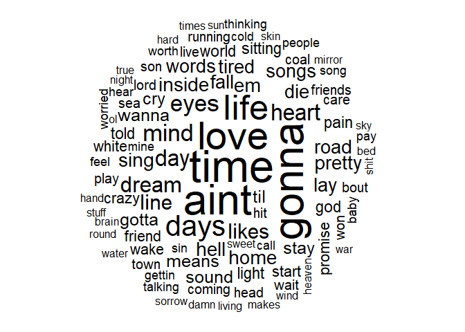<!-- -->

```r
## for each album
word_count_htm <- tidy_sturgill %>%
    filter(album_name == "High Top Mountain") %>%
    count(word, sort = TRUE) %>%
    mutate(word = reorder(word, n)) %>%
    ungroup() %>%
    drop_na(word)

word_count_ms <- tidy_sturgill %>%
    filter(album_name == "Metamodern Sounds in Country Music") %>%
    count(word, sort = TRUE) %>%
    mutate(word = reorder(word, n)) %>%
    ungroup() %>%
    drop_na(word)
    
word_count_sge <- tidy_sturgill %>%
    filter(album_name == "A Sailor's Guide to Earth") %>%
    count(word, sort = TRUE) %>%
    mutate(word = reorder(word, n)) %>%
    ungroup() %>%
    drop_na(word)
    
word_count_sf <- tidy_sturgill %>%
    filter(album_name == "SOUND & FURY") %>%
    count(word, sort = TRUE) %>%
    mutate(word = reorder(word, n)) %>%
    ungroup() %>%
    drop_na(word)    

p1 <- wordcloud(words = word_count_htm$word, freq = word_count_htm$n,
          max.words = 100, random.order = FALSE)
```

<!-- -->

```r
p2 <- wordcloud(words = word_count_ms$word, freq = word_count_ms$n,
          max.words = 100, random.order = FALSE)
```

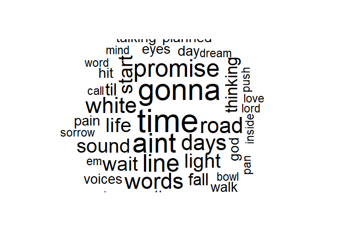<!-- -->

```r
p3 <- wordcloud(words = word_count_sge$word, freq = word_count_sge$n,
          max.words = 100, random.order = FALSE)
```

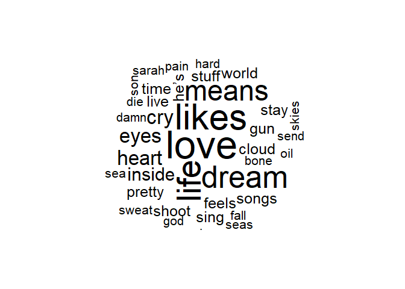<!-- -->

```r
p4 <- wordcloud(words = word_count_sf$word, freq = word_count_sf$n,
          max.words = 100, random.order = FALSE)
```

<!-- -->

# Lyrics analysis - NRC by album
Next we can look at lyrics by album according to the NRC leixcon, which sorts words into eight categories -- joy, anticipation, trust, surprise, sadness, anger, disgust and fear. 


```r
tidy_sturgill_nrc <- tidy_sturgill %>%
    inner_join(get_sentiments("nrc")) %>%
    filter(!sentiment %in% c("positive", "negative"))
```

```
## Joining, by = "word"
```

```r
sentiment_sturgill <- tidy_sturgill_nrc %>%
    group_by(album_name, sentiment) %>%
    count(album_name, sentiment)

sentiment_sturgill_albums <- sentiment_sturgill %>%
    group_by(album_name) %>%
    summarise(total_sentiments = sum(`n`))

sentiment_sturgill <- sentiment_sturgill %>%
    left_join(sentiment_sturgill_albums, by = "album_name") %>%
    mutate(perc = round(n/total_sentiments,3)) %>%
    select(-c(total_sentiments, `n`)) 

sentiment_sturgill_radar <- sentiment_sturgill %>%
    pivot_wider(names_from = "album_name", values_from = "perc") 

## radar
chartJSRadar(sentiment_sturgill_radar)
```

<!--html_preserve--><canvas id="htmlwidget-4a2c5105766f05a65d41" class="chartJSRadar html-widget" width="672" height="480"></canvas>
<script type="application/json" data-for="htmlwidget-4a2c5105766f05a65d41">{"x":{"data":{"labels":["anger","anticipation","disgust","fear","joy","sadness","surprise","trust"],"datasets":[{"label":"SOUND & FURY","data":[0.123,0.175,0.084,0.149,0.13,0.146,0.065,0.127],"backgroundColor":"rgba(255,0,0,0.2)","borderColor":"rgba(255,0,0,0.8)","pointBackgroundColor":"rgba(255,0,0,0.8)","pointBorderColor":"#fff","pointHoverBackgroundColor":"#fff","pointHoverBorderColor":"rgba(255,0,0,0.8)"},{"label":"A Sailor's Guide to Earth","data":[0.113,0.131,0.055,0.164,0.172,0.161,0.033,0.172],"backgroundColor":"rgba(0,255,0,0.2)","borderColor":"rgba(0,255,0,0.8)","pointBackgroundColor":"rgba(0,255,0,0.8)","pointBorderColor":"#fff","pointHoverBackgroundColor":"#fff","pointHoverBorderColor":"rgba(0,255,0,0.8)"},{"label":"Metamodern Sounds in Country Music","data":[0.109,0.187,0.056,0.141,0.158,0.144,0.039,0.165],"backgroundColor":"rgba(0,0,255,0.2)","borderColor":"rgba(0,0,255,0.8)","pointBackgroundColor":"rgba(0,0,255,0.8)","pointBorderColor":"#fff","pointHoverBackgroundColor":"#fff","pointHoverBorderColor":"rgba(0,0,255,0.8)"},{"label":"High Top Mountain","data":[0.117,0.151,0.099,0.129,0.129,0.167,0.052,0.156],"backgroundColor":"rgba(255,255,0,0.2)","borderColor":"rgba(255,255,0,0.8)","pointBackgroundColor":"rgba(255,255,0,0.8)","pointBorderColor":"#fff","pointHoverBackgroundColor":"#fff","pointHoverBorderColor":"rgba(255,255,0,0.8)"}]},"options":{"responsive":true,"title":{"display":false,"text":null},"scale":{"ticks":{"min":0},"pointLabels":{"fontSize":18}},"tooltips":{"enabled":true,"mode":"label"},"legend":{"display":true}}},"evals":[],"jsHooks":[]}</script><!--/html_preserve-->

```r
## bar plot
ggplot(sentiment_sturgill, aes(x = sentiment, y = perc, fill = album_name)) + 
    geom_bar(stat = "identity", position = position_dodge()) +
    scale_fill_manual(values = c("firebrick", "navyblue", "purple", "gold1")) +
    theme(axis.text.x = element_text(angle = 45, hjust = 1))
```

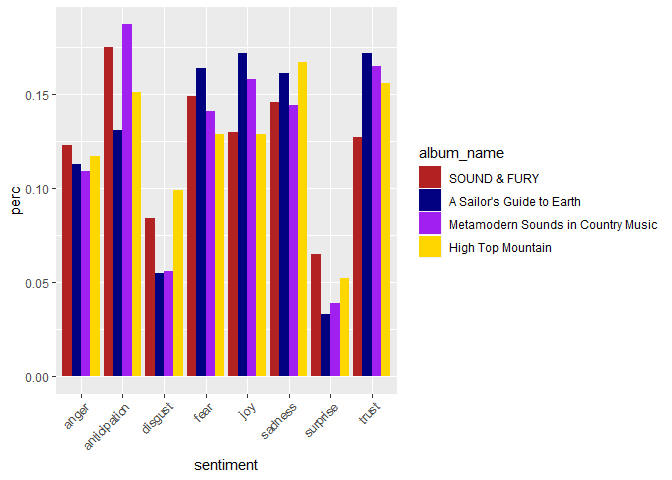<!-- -->

Across his albums, surprise, disgust, and anger are fairly infrequent emotions expressed in his lyrics, with relatively high levels of fear, joy, sadness, and trust. 

# Lyrics analysis - NRC by track


```r
sentiment_sturgill_track <- tidy_sturgill_nrc %>%
    group_by(track_name, sentiment) %>%
    count(track_name, sentiment) 

sentiment_sturgill_track2 <- sentiment_sturgill_track %>%
    group_by(track_name) %>%
    summarise(total_sentiments = sum(`n`)) 

sentiment_sturgill_track <- sentiment_sturgill_track %>%
    left_join(sentiment_sturgill_track2, by = "track_name") %>%
    mutate(perc = round(n/total_sentiments,3)) %>%
    select(-c(total_sentiments, `n`)) 


sentiment_sturgill_track %>%
    filter(sentiment == "sadness") %>%
    arrange(desc(perc)) %>%
    head(10)
```

```
## # A tibble: 10 x 3
## # Groups:   track_name, sentiment [10]
##    track_name                       sentiment  perc
##    <chr>                            <chr>     <dbl>
##  1 Old King Coal                    sadness   0.333
##  2 Remember To Breathe              sadness   0.333
##  3 Railroad of Sin                  sadness   0.312
##  4 Breakers Roar                    sadness   0.3  
##  5 Welcome To Earth (Pollywog)      sadness   0.3  
##  6 Brace For Impact (Live A Little) sadness   0.28 
##  7 Panbowl - Bonus Track            sadness   0.259
##  8 Voices                           sadness   0.233
##  9 All Around You                   sadness   0.217
## 10 I'd Have to Be Crazy             sadness   0.211
```

We can also look at which songs have the highest percentage of sad lyrics. One third of "Old King Coal" and "Remember to Breathe" have words that express sadness according to the nrc lexicon. That definitely tracks with "Old King Coal" in particular -- a song about economic struggles and opioids in Appalachian coal communities. Here are the first two verses: 
 
> Many a man down in these here hills
Made a living off that old black gold
Now there ain't nothing but welfare and pills
And the wind never felt so cold
I'll be one of the first in a long long line
Not to go down from that old black lung
My death will be slower than the rest of my kind
And my life will be sadder than the songs they all sung

Yeah, those are some sad lyrics. 

# Compare valence vs. lyrics analysis
Finally, we can compare lyrical sentiment with sonic features like valence to see whether Sturgill's songs are typically cohesive in the sense that sad-sounding songs also have sad lyrics, and vice versa. In cohesive songs we might expect valence and the nrc sentiment to be closely related.

To test this, we can combine the original spotifyr data frame with the track sentiment analysis data frame.


```r
sentiment_sturgill_track_sum <- sentiment_sturgill_track %>%
    group_by(track_name) %>%
    summarize(neg_emotions = sum(perc[sentiment == "anger" | sentiment == "disgust" |
                                        sentiment == "fear" | sentiment == "sadness"]))

sentiment_sturgill_combined <- sturgill %>%
    select(track_name, valence, energy) %>%
    inner_join(sentiment_sturgill_track_sum, by = "track_name")

sentiment_sturgill_combined %>%
    ggplot(aes(x = neg_emotions, y = valence, label = track_name)) +
    geom_point() + 
    geom_text(size = 3, check_overlap = TRUE) + 
    theme(panel.background = element_rect(fill = "white")) +
    theme(plot.background = element_rect(fill = "white")) +
    ggtitle("Sturgill Simpson's Music:
Negative-Sentiment Lyrics vs. Valence") +
    xlab("Percentage Lyrics with Negative Emotions") + 
    ylab("Happiness (Valence score)")
```

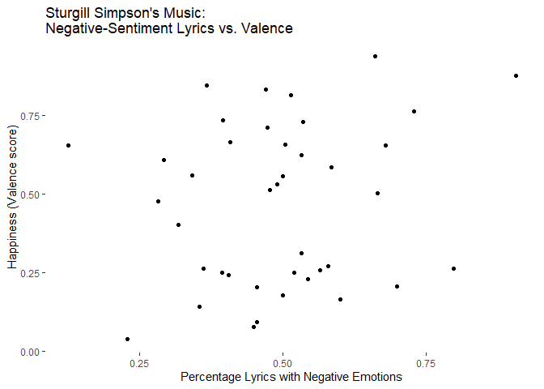<!-- -->

As the resulting plot shows, there appears to be little relationship between a song's lyrics and how happy or sad the song itself is. That makes for interesting contrasts between lyrical sentiment and a song's feeling. 

For example, "Mercury in Retrograde" is both high-valence and has a high percentage of negative emotions expressed in its lyrics. While the music itself is bouncy and funky, the lyrics express disdain at the fakeness and self-serving mentality of people in the music business:

> Living the dream makes a man wanna scream
Light a match and burn it all down
Head back home to the mountain
Far away from all of the pull
Oh, all the journalists and sycophants wielding their brands
And all the traveling trophies and award show stands
And all the haters wishing they was in my band
Sorry, boys, the bus is plumb full
Mercury must be in retrograde again
But at least it's not just hangin' around, pretendin' to be my friend
Oh, the road to Hell is paved with cruel intention
If it's not nuclear war, it's gonna be a divine intervention


